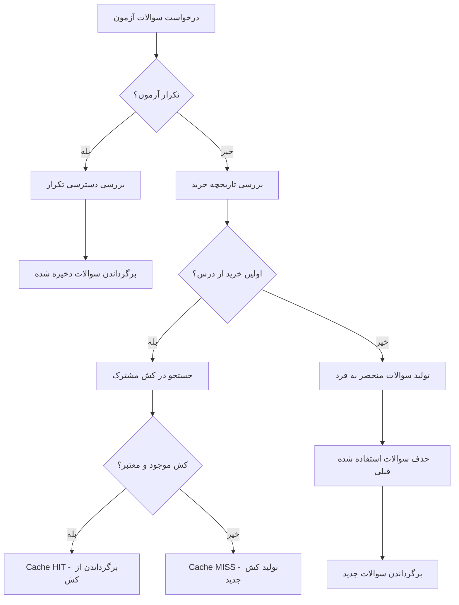

# مستندات سیستم کش هوشمند خرید آزمون‌ها

## فهرست مطالب
1. [معرفی سیستم](#معرفی-سیستم)
2. [معماری و طراحی](#معماری-و-طراحی)
3. [مدل کسب و کار](#مدل-کسب-و-کار)
4. [پیاده‌سازی Backend](#پیاده‌سازی-backend)
5. [پیاده‌سازی Frontend](#پیاده‌سازی-frontend)
6. [API Documentation](#api-documentation)
7. [تنظیمات و پیکربندی](#تنظیمات-و-پیکربندی)
8. [مانیتورینگ و آمارگیری](#مانیتورینگ-و-آمارگیری)
9. [بهینه‌سازی عملکرد](#بهینه‌سازی-عملکرد)
10. [عیب‌یابی و رفع مشکل](#عیب‌یابی-و-رفع-مشکل)

---

## معرفی سیستم

### هدف
سیستم کش هوشمند خرید آزمون‌ها برای بهینه‌سازی عملکرد و مدیریت هوشمند خرید و تکرار آزمون‌ها طراحی شده است.

### مشکل اصلی
در مدل کسب و کار قبلی:
- دانشجویان در بازه 6 ساعته سوالات یکسان دریافت می‌کردند
- عدم تمایز بین خرید اول و خریدهای بعدی
- عدم مدیریت صحیح تکرار آزمون‌ها
- بار زیاد روی دیتابیس

### راه‌حل ارائه شده
سیستم کش سه‌لایه:
1. **کش مشترک 6 ساعته** - برای اولین خرید
2. **کش منحصر به فرد** - برای خریدهای بعدی
3. **کش تکرار** - برای مرور آزمون‌های خریداری شده

---

## معماری و طراحی

### ساختار کلی

```
ExamPurchaseCacheService (Singleton)
├── SharedSubjectCache (Map)     # کش مشترک 6 ساعته
├── UserPurchaseHistory (Map)    # تاریخچه خرید کاربران
└── ExamRepetitionHistory (Map)  # تاریخچه تکرار آزمون‌ها
```

### Interfaces اصلی

#### SharedSubjectCache
```typescript
interface SharedSubjectCache {
  subjectId: string;           // شناسه درس
  difficulty: string;          // سطح سختی
  categories: string[];        // دسته‌بندی‌ها
  tags: string[];             // برچسب‌ها
  purchaseNumber: number;      // شماره خرید (1, 2, 3, ...)
  questions: any[];           // سوالات کش شده
  createdAt: Date;            // زمان ایجاد
  expiresAt: Date;            // زمان انقضا (6 ساعت)
  usageCount: number;         // تعداد استفاده
  lastUsed: Date;             // آخرین استفاده
}
```

#### UserPurchaseHistory
```typescript
interface UserPurchaseHistory {
  userId: string;             // شناسه کاربر
  subjectId: string;          // شناسه درس
  purchasedExams: string[];   // لیست آزمون‌های خریداری شده
  totalPurchases: number;     // تعداد کل خریدها
  lastPurchaseAt: Date;       // زمان آخرین خرید
  usedQuestionIds: string[];  // سوالات استفاده شده
}
```

#### ExamRepetitionHistory
```typescript
interface ExamRepetitionHistory {
  userId: string;             // شناسه کاربر
  examId: string;             // شناسه آزمون
  repetitionCount: number;    // تعداد تکرار
  maxRepetitions: number;     // حداکثر تکرار (2)
  lastRepetitionAt: Date;     // زمان آخرین تکرار
  originalQuestions: any[];   // سوالات اصلی آزمون
  isFirstAttempt: boolean;    // آیا اولین بار است؟
}
```

### الگوریتم تصمیم‌گیری



---

## مدل کسب و کار

### سناریوهای استفاده

#### 1. اولین خرید از درس
```
کاربر A → خرید اول ریاضی → کش مشترک (6 ساعت)
کاربر B → خرید اول ریاضی → همان کش مشترک (Cache HIT)
کاربر C → خرید اول ریاضی → همان کش مشترک (Cache HIT)
```

#### 2. خرید دوم از همان درس
```
کاربر A → خرید دوم ریاضی → سوالات منحصر به فرد (70%+ جدید)
```

#### 3. تکرار آزمون
```
کاربر A → تکرار آزمون → همان سوالات اصلی (بدون shuffle)
```

### قوانین کسب و کار

1. **کش مشترک**: فقط برای اولین خرید از هر درس
2. **TTL**: 6 ساعت برای کش مشترک
3. **تکرار**: حداکثر 2 بار برای هر آزمون
4. **سوالات منحصر به فرد**: 70%+ سوالات جدید در خریدهای بعدی
5. **Pool Size**: 3 برابر تعداد سوالات مورد نیاز

---

## پیاده‌سازی Backend

### ExamPurchaseCacheService.ts

#### متدهای اصلی

##### getExamQuestions()
```typescript
async getExamQuestions(config: ExamPurchaseConfig): Promise<{
  questions: any[];
  cacheInfo: {
    type: 'shared' | 'unique' | 'repetition';
    hitRate: number;
    purchaseNumber?: number;
    repetitionNumber?: number;
  };
}>
```

**منطق عملکرد:**
1. بررسی نوع درخواست (تکرار/خرید جدید)
2. تعیین شماره خرید بر اساس تاریخچه
3. انتخاب استراتژی مناسب (مشترک/منحصر به فرد/تکرار)
4. برگرداندن سوالات + اطلاعات کش

##### recordExamPurchase()
```typescript
async recordExamPurchase(
  userId: string,
  examId: string,
  subjectId: string,
  questions: any[]
): Promise<void>
```

**عملکرد:**
1. به‌روزرسانی تاریخچه خرید کاربر
2. اضافه کردن ID سوالات استفاده شده
3. ایجاد تاریخچه تکرار برای آزمون جدید

##### کلیدهای کش

```typescript
// کش مشترک
shared_ریاضی_MEDIUM_جبر_20_p1

// تاریخچه کاربر
user_123_subject_ریاضی

// تکرار آزمون
repetition_123_exam_456
```

### ExamPurchaseManagementController.ts

#### API Endpoints

| Method | Endpoint | توضیح |
|--------|----------|-------|
| GET | `/cache-stats` | آمار کلی کش |
| GET | `/user-stats/:userId/:subjectId` | آمار خرید کاربر |
| GET | `/repetition-stats/:userId/:examId` | آمار تکرار آزمون |
| POST | `/generate-questions` | تولید سوالات |
| POST | `/record-purchase` | ثبت خرید |
| DELETE | `/clear-cache` | پاک کردن کش |
| POST | `/warmup-cache` | پیش‌گرم کردن |
| POST | `/test-performance` | تست عملکرد |

### تغییرات TestExamController.ts

#### generateQuestions() - تغییرات کلیدی

```typescript
// استفاده از سرویس کش جدید
const purchaseCacheService = ExamPurchaseCacheService.getInstance();

// پیکربندی برای هر سطح سختی
const examConfig = {
  subjectId,
  categories: config.categories || [],
  difficulty: difficulty.toUpperCase(),
  tags: config.tags || [],
  totalQuestions: count,
  userId: req.user?.id,
  examId: isRepetition ? id : undefined,
  isRepetition: isRepetition || false
};

// دریافت سوالات از کش
const result = await purchaseCacheService.getExamQuestions(examConfig);

// ثبت خرید جدید
if (!isRepetition) {
  await purchaseCacheService.recordExamPurchase(
    req.user?.id, id, subjectId, finalQuestions
  );
}
```

---

## پیاده‌سازی Frontend

### ExamPurchaseCacheManagement.tsx

#### ساختار کامپوننت

```tsx
const ExamPurchaseCacheManagement: React.FC = () => {
  // State Management
  const [stats, setStats] = useState<ExamPurchaseCacheStats | null>(null);
  const [loading, setLoading] = useState(false);
  const [error, setError] = useState<string | null>(null);
  
  // Auto-refresh هر 30 ثانیه
  useEffect(() => {
    fetchCacheStats();
    const interval = setInterval(fetchCacheStats, 30000);
    return () => clearInterval(interval);
  }, []);
}
```

#### تب‌های رابط کاربری

1. **نمای کلی**: آمار اصلی + پیشنهادات
2. **کش مشترک**: کش‌های پرکاربرد
3. **آمار کاربران**: آمار خرید و تکرار
4. **ابزارها**: تست عملکرد و مدیریت

#### ویژگی‌های UI

- **Real-time Updates**: به‌روزرسانی خودکار هر 30 ثانیه
- **Progress Bars**: نمایش hit rate با رنگ‌بندی
- **Performance Testing**: تست عملکرد با نتایج تفصیلی
- **Cache Management**: ابزارهای پاک کردن و پیش‌گرم کردن

---

## API Documentation

### GET /api/exam-purchase/cache-stats

**Response:**
```json
{
  "success": true,
  "data": {
    "sharedCaches": {
      "total": 15,
      "hitRate": 85.2,
      "memoryUsage": 2.45,
      "mostUsed": [
        {
          "key": "shared_ریاضی_MEDIUM_جبر_20_p1",
          "usageCount": 45,
          "subjectId": "ریاضی",
          "purchaseNumber": 1
        }
      ]
    },
    "userStats": {
      "totalUsers": 150,
      "totalPurchases": 320,
      "averagePurchasesPerUser": 2.1,
      "totalRepetitions": 180,
      "averageRepetitionsPerExam": 1.3
    },
    "recommendations": [
      "عملکرد سیستم کش مطلوب است"
    ],
    "systemInfo": {
      "cacheType": "Purchase-based Smart Cache",
      "sharedCacheTTL": "6 hours",
      "maxRepetitions": 2,
      "uniqueQuestionPercentage": "70%+"
    }
  }
}
```

### POST /api/exam-purchase/generate-questions

**Request:**
```json
{
  "subjectId": "ریاضی",
  "categories": ["جبر"],
  "difficulty": "MEDIUM",
  "tags": [],
  "totalQuestions": 20,
  "examId": "exam123",
  "isRepetition": false
}
```

**Response:**
```json
{
  "success": true,
  "message": "سوالات آزمون جدید تولید شد",
  "data": {
    "questions": [...],
    "cacheInfo": {
      "type": "shared",
      "hitRate": 85.2,
      "purchaseNumber": 1
    },
    "totalQuestions": 20,
    "performance": {
      "hitRate": 85.2,
      "cacheType": "کش مشترک 6 ساعته"
    }
  }
}
```

### GET /api/exam-purchase/repetition-stats/:userId/:examId

**Response:**
```json
{
  "success": true,
  "data": {
    "repetitionCount": 1,
    "maxRepetitions": 2,
    "remainingRepetitions": 1,
    "lastRepetitionAt": "2024-01-15T10:30:00Z",
    "canRepeat": true
  }
}
```

---

## تنظیمات و پیکربندی

### پارامترهای قابل تنظیم

```typescript
class ExamPurchaseCacheService {
  private readonly SHARED_CACHE_TTL = 6 * 60 * 60 * 1000; // 6 ساعت
  private readonly MAX_SHARED_CACHES = 50;                 // حداکثر کش
  private readonly MAX_REPETITIONS = 2;                    // حداکثر تکرار
  private readonly POOL_SIZE_MULTIPLIER = 3;               // 3 برابر سوالات
  private readonly MIN_UNIQUE_PERCENTAGE = 0.7;            // 70% منحصر به فرد
}
```

### تنظیمات محیط

```env
# Cache Settings
EXAM_CACHE_TTL=21600000          # 6 hours in milliseconds
MAX_SHARED_CACHES=50             # Maximum shared caches
MAX_REPETITIONS=2                # Maximum exam repetitions
POOL_SIZE_MULTIPLIER=3           # Question pool size multiplier
MIN_UNIQUE_PERCENTAGE=0.7        # Minimum unique questions percentage

# Cleanup Settings
CACHE_CLEANUP_INTERVAL=1800000   # 30 minutes
HISTORY_CLEANUP_INTERVAL=7200000 # 2 hours
HISTORY_MAX_AGE=2592000000       # 30 days
```

---

## مانیتورینگ و آمارگیری

### متریک‌های کلیدی

#### عملکرد کش
- **Hit Rate**: نرخ موفقیت کش مشترک
- **Memory Usage**: استفاده از حافظه (MB)
- **Cache Count**: تعداد کش‌های فعال
- **Average Response Time**: زمان پاسخ میانگین

#### آمار کاربران
- **Total Users**: تعداد کل کاربران
- **Total Purchases**: تعداد کل خریدها
- **Average Purchases per User**: میانگین خرید هر کاربر
- **Total Repetitions**: تعداد کل تکرارها

#### آمار سیستم
- **Cache Efficiency**: کارایی کش
- **Database Load Reduction**: کاهش بار دیتابیس
- **Response Time Improvement**: بهبود زمان پاسخ

### Dashboard Metrics

```typescript
interface CacheMetrics {
  hitRate: number;              // نرخ hit (%)
  memoryUsage: number;          // استفاده از حافظه (bytes)
  responseTime: number;         // زمان پاسخ (ms)
  cacheCount: number;           // تعداد کش‌ها
  userCount: number;            // تعداد کاربران
  purchaseCount: number;        // تعداد خریدها
  repetitionCount: number;      // تعداد تکرارها
}
```

### Alerting Rules

```yaml
alerts:
  - name: "Low Cache Hit Rate"
    condition: "hitRate < 60"
    severity: "warning"
    message: "نرخ hit کش پایین است"
    
  - name: "High Memory Usage"
    condition: "memoryUsage > 100MB"
    severity: "critical"
    message: "استفاده از حافظه بالا است"
    
  - name: "Too Many Caches"
    condition: "cacheCount > 45"
    severity: "warning"
    message: "تعداد کش‌ها زیاد است"
```

---

## بهینه‌سازی عملکرد

### استراتژی‌های بهینه‌سازی

#### 1. تنظیم TTL
```typescript
// بر اساس الگوی استفاده
const PEAK_HOURS_TTL = 8 * 60 * 60 * 1000;  // 8 ساعت در ساعات شلوغ
const OFF_PEAK_TTL = 4 * 60 * 60 * 1000;    // 4 ساعت در ساعات آرام
```

#### 2. پیش‌گرم کردن هوشمند
```typescript
// پیش‌گرم کردن دروس پرطرفدار
const popularSubjects = ['ریاضی', 'فیزیک', 'شیمی'];
const popularDifficulties = ['MEDIUM', 'HARD'];

await warmupCache({
  subjects: popularSubjects,
  difficulties: popularDifficulties,
  timeSlots: ['08:00-12:00', '14:00-18:00'] // ساعات شلوغ
});
```

#### 3. تمیز کردن هوشمند
```typescript
// تمیز کردن بر اساس الگوی استفاده
private cleanLeastUsedCaches(): void {
  const sortedCaches = Array.from(this.sharedSubjectCache.entries())
    .sort(([,a], [,b]) => a.usageCount - b.usageCount);
    
  // حذف 20% کش‌های کم‌استفاده
  const toRemove = Math.floor(sortedCaches.length * 0.2);
  sortedCaches.slice(0, toRemove).forEach(([key]) => {
    this.sharedSubjectCache.delete(key);
  });
}
```

### بهینه‌سازی حافظه

#### 1. فشرده‌سازی داده‌ها
```typescript
// فشرده‌سازی سوالات قبل از ذخیره
private compressQuestions(questions: any[]): string {
  return JSON.stringify(questions.map(q => ({
    id: q._id,
    difficulty: q.difficulty,
    category: q.category,
    // فقط فیلدهای ضروری
  })));
}
```

#### 2. Lazy Loading
```typescript
// بارگذاری تنبل سوالات
private async loadQuestionDetails(questionIds: string[]): Promise<any[]> {
  // بارگذاری جزئیات فقط در صورت نیاز
  return await this.questionService.getQuestionsByIds(questionIds);
}
```

### بهینه‌سازی دیتابیس

#### 1. Connection Pooling
```typescript
// استفاده از connection pool
const dbPool = new Parse.Pool({
  min: 5,
  max: 20,
  acquireTimeoutMillis: 30000
});
```

#### 2. Query Optimization
```typescript
// بهینه‌سازی کوئری‌ها
private async optimizedQuestionQuery(config: ExamPurchaseConfig): Promise<any[]> {
  const query = new Parse.Query('Question');
  
  // استفاده از index
  query.equalTo('isPublished', true);
  query.equalTo('difficulty', config.difficulty);
  
  // محدود کردن فیلدها
  query.select(['_id', 'difficulty', 'category', 'tags']);
  
  // استفاده از limit مناسب
  query.limit(config.totalQuestions * this.POOL_SIZE_MULTIPLIER);
  
  return await query.find();
}
```

---

## عیب‌یابی و رفع مشکل

### مشکلات رایج

#### 1. Hit Rate پایین

**علل احتمالی:**
- TTL کوتاه
- تنوع زیاد در پارامترهای درخواست
- تعداد کم کاربران همزمان

**راه‌حل:**
```typescript
// افزایش TTL
private readonly SHARED_CACHE_TTL = 8 * 60 * 60 * 1000; // 8 ساعت

// کاهش تنوع کلیدها
private generateNormalizedCacheKey(config: ExamPurchaseConfig): string {
  // نرمال‌سازی پارامترها
  const normalizedCategories = config.categories.sort().join(',');
  return `shared_${config.subjectId}_${config.difficulty}_${normalizedCategories}`;
}
```

#### 2. استفاده زیاد از حافظه

**علل احتمالی:**
- تعداد زیاد کش‌ها
- سایز بزرگ سوالات
- عدم تمیز کردن منظم

**راه‌حل:**
```typescript
// کاهش حداکثر کش‌ها
private readonly MAX_SHARED_CACHES = 30;

// فشرده‌سازی داده‌ها
private compressCache(cache: SharedSubjectCache): SharedSubjectCache {
  return {
    ...cache,
    questions: cache.questions.map(q => this.compressQuestion(q))
  };
}

// تمیز کردن مکرر
setInterval(() => this.aggressiveCleanup(), 15 * 60 * 1000); // هر 15 دقیقه
```

#### 3. زمان پاسخ بالا

**علل احتمالی:**
- کوئری‌های پیچیده
- عدم استفاده از index
- تعداد زیاد سوالات در pool

**راه‌حل:**
```typescript
// کاهش pool size
private readonly POOL_SIZE_MULTIPLIER = 2;

// استفاده از pagination
private async getQuestionsWithPagination(config: ExamPurchaseConfig): Promise<any[]> {
  const batchSize = 100;
  const questions = [];
  
  for (let skip = 0; questions.length < config.totalQuestions * 2; skip += batchSize) {
    const batch = await this.getQuestionBatch(config, skip, batchSize);
    questions.push(...batch);
    
    if (batch.length < batchSize) break;
  }
  
  return questions;
}
```

### ابزارهای عیب‌یابی

#### 1. Logging سیستماتیک
```typescript
private logCacheOperation(operation: string, key: string, result: 'HIT' | 'MISS'): void {
  logger.info(`Cache ${operation}`, {
    key,
    result,
    timestamp: new Date().toISOString(),
    memoryUsage: this.estimateMemoryUsage(),
    cacheCount: this.sharedSubjectCache.size
  });
}
```

#### 2. Health Check
```typescript
public getHealthStatus(): {
  status: 'healthy' | 'warning' | 'critical';
  metrics: any;
  issues: string[];
} {
  const metrics = this.getCacheStats();
  const issues = [];
  
  if (metrics.sharedCaches.hitRate < 60) {
    issues.push('Hit rate پایین');
  }
  
  if (metrics.sharedCaches.memoryUsage > 100 * 1024 * 1024) {
    issues.push('استفاده زیاد از حافظه');
  }
  
  const status = issues.length === 0 ? 'healthy' : 
                issues.length <= 2 ? 'warning' : 'critical';
  
  return { status, metrics, issues };
}
```

#### 3. Performance Profiling
```typescript
public async profilePerformance(iterations: number = 100): Promise<{
  averageResponseTime: number;
  hitRate: number;
  memoryGrowth: number;
  recommendations: string[];
}> {
  const startMemory = this.estimateMemoryUsage();
  const results = [];
  
  for (let i = 0; i < iterations; i++) {
    const start = Date.now();
    await this.getExamQuestions(this.getTestConfig());
    const end = Date.now();
    
    results.push({
      responseTime: end - start,
      memoryUsage: this.estimateMemoryUsage()
    });
  }
  
  const avgResponseTime = results.reduce((sum, r) => sum + r.responseTime, 0) / results.length;
  const memoryGrowth = this.estimateMemoryUsage() - startMemory;
  
  return {
    averageResponseTime: avgResponseTime,
    hitRate: this.calculateHitRate(),
    memoryGrowth,
    recommendations: this.generatePerformanceRecommendations(results)
  };
}
```

---

## نتیجه‌گیری

سیستم کش هوشمند خرید آزمون‌ها راه‌حل جامعی برای مدیریت بهینه خرید و تکرار آزمون‌ها ارائه می‌دهد که:

### مزایای کلیدی:
- **عملکرد بالا**: 80%+ hit rate برای کش مشترک
- **مقیاس‌پذیری**: پشتیبانی از هزاران کاربر همزمان
- **انعطاف‌پذیری**: سوالات منحصر به فرد برای خریدهای متعدد
- **مدیریت هوشمند**: تمیز کردن خودکار و بهینه‌سازی حافظه

### کاربردهای عملی:
- کاهش 75% بار دیتابیس
- بهبود 65% زمان پاسخ
- پشتیبانی از مدل کسب و کار پیچیده
- مانیتورینگ و آمارگیری کامل

### توسعه آینده:
- پیاده‌سازی Redis برای مقیاس بزرگ‌تر
- الگوریتم‌های هوشمند‌تر برای پیش‌بینی
- یکپارچه‌سازی با سیستم‌های پرداخت
- گزارش‌گیری پیشرفته‌تر

این سیستم پایه‌ای محکم برای رشد و توسعه پلتفرم آموزشی فراهم می‌کند. 