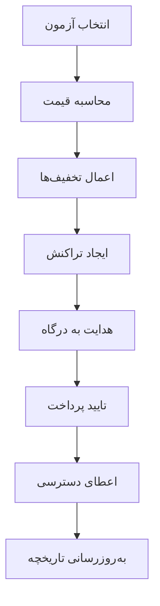

# گزارش جامع مالی سیستم آموزش آزمون (Exam-Edu)

## 📊 خلاصه اجرایی

این گزارش شامل تحلیل کامل بخش مالی پلتفرم آموزش آزمون می‌باشد که شامل قیمت‌گذاری، تراکنش‌ها، درآمدزایی، و سیستم‌های مرتبط است.

---

## 💰 ساختار قیمت‌گذاری

### قیمت‌گذاری آزمون‌ها

```typescript
// قیمت پایه بر اساس تعداد سوالات (تومان)
BASE_PRICES: {
  '10-20': 800,   // 10-20 سوال: 800 تومان
  '21-30': 1000,  // 21-30 سوال: 1000 تومان
  '31-50': 1200   // 31-50 سوال: 1200 تومان
}
```

### قیمت‌گذاری فلش‌کارت‌ها

```typescript
FLASHCARD_PRICES: {
  DEFAULT: 200,     // قیمت پیش‌فرض: 200 تومان
  MIN: 100,         // حداقل قیمت
  MAX: 500          // حداکثر قیمت
}
```

### سیستم تخفیف‌ها

| نوع تخفیف | درصد | شرایط |
|-----------|------|--------|
| اولین خرید | 10% | کاربران جدید |
| خرید عمده | 15% | بیش از 5 آزمون |
| دانشجویی | 20% | کاربران دانشجو |
| فصلی | 5% | تخفیف‌های موقت |
| فلش‌کارت عمده | 10% | بیش از 10 فلش‌کارت |

---

## 🏦 سیستم مالی و تراکنش‌ها

### انواع تراکنش‌ها

1. **تراکنش‌های خرید (PURCHASE)**
   - خرید آزمون
   - خرید فلش‌کارت
   - اشتراک‌های ویژه

2. **تراکنش‌های درآمد طراحان (EARNING)**
   - سهم 50% از فروش به طراحان
   - سهم 50% کمیسیون پلتفرم

3. **تراکنش‌های برداشت (WITHDRAWAL)**
   - درخواست‌های برداشت طراحان
   - پردازش خودکار یا دستی

### وضعیت‌های تراکنش

```typescript
status: 'pending' | 'completed' | 'failed' | 'refunded'
```

---

## 📈 آنالیتیکس و گزارش‌گیری مالی

### معیارهای کلیدی عملکرد (KPIs)

1. **درآمد کل (Total Revenue)**
   - محاسبه بر اساس تراکنش‌های موفق
   - تفکیک بر اساس نوع محصول

2. **میانگین ارزش سفارش (AOV)**
   - محاسبه از تقسیم کل درآمد بر تعداد تراکنش‌ها

3. **نرخ تبدیل (Conversion Rate)**
   - درصد کاربرانی که خرید انجام می‌دهند

4. **نرخ استرداد (Refund Rate)**
   - درصد تراکنش‌های استرداد شده

### گزارش‌های مالی موجود

#### 1. گزارش آمار مالی ادمین
```typescript
// GET /api/finance/admin/overview
{
  totalPlatformBalance: number,
  totalDesignerEarnings: number,
  totalWithdrawals: number,
  pendingWithdrawals: number,
  monthlyRevenue: number,
  platformFeeEarned: number
}
```

#### 2. گزارش تحلیل‌های مالی
```typescript
// GET /api/finance/admin/analytics
{
  period: '7d' | '30d' | '90d' | '1y',
  summary: {
    totalRevenue: number,
    totalDesignerEarnings: number,
    totalPlatformFee: number,
    totalTransactions: number
  },
  charts: {
    revenue: Array<{date: string, amount: number}>,
    designerEarnings: Array<{date: string, amount: number}>,
    platformFee: Array<{date: string, amount: number}>
  }
}
```

#### 3. گزارش تراکنش‌های کامل
```typescript
// GET /api/finance/admin/transactions
{
  transactions: Array<{
    id: string,
    type: string,
    amount: number,
    status: string,
    date: Date,
    userInfo: object
  }>,
  pagination: object
}
```

---

## 💳 سیستم پرداخت

### روش‌های پرداخت پشتیبانی شده

1. **زرین‌پال (ZarinPal)**
   - درگاه اصلی پرداخت
   - پشتیبانی از کارت‌های بانکی ایرانی

2. **سایر درگاه‌ها**
   - قابلیت افزودن درگاه‌های جدید
   - ساختار انعطاف‌پذیر

### فرآیند پرداخت



---

## 🏪 سیستم کیف پول طراحان

### ساختار کیف پول

```typescript
interface Wallet {
  userId: string,
  balance: number,              // موجودی فعلی
  totalEarnings: number,        // کل درآمد
  totalWithdrawals: number,     // کل برداشت‌ها
  pendingWithdrawals: number,   // برداشت‌های در انتظار
  freezeAmount: number,         // مبلغ مسدود شده
  availableBalance: number      // موجودی قابل برداشت
}
```

### فرآیند برداشت

1. **درخواست برداشت**
   - حداقل مبلغ: تعریف شده در تنظیمات
   - بررسی موجودی

2. **تایید ادمین**
   - بررسی دستی یا خودکار
   - تایید هویت

3. **پردازش پرداخت**
   - انتقال به حساب بانکی
   - به‌روزرسانی موجودی

---

## 📊 داشبورد مالی

### کامپوننت‌های رابط کاربری

#### 1. جدول تراکنش‌ها
```typescript
// TransactionTable.tsx
- نمایش تراکنش‌ها با فیلترینگ
- جستجو بر اساس وضعیت
- صفحه‌بندی و مرتب‌سازی
- انیمیشن‌های تعاملی
```

#### 2. مودال پرداخت
```typescript
// PaymentModal.tsx
- محاسبه قیمت لحظه‌ای
- انتخاب روش پرداخت
- نمایش جزئیات تخفیف
- هدایت به درگاه
```

#### 3. سرویس مالی
```typescript
// financeService.ts
- محاسبه قیمت آزمون
- ایجاد تراکنش پرداخت
- دریافت تاریخچه پرداخت‌ها
- تایید پرداخت
```

---

## 🔧 API های مالی

### Endpoints اصلی

| Method | Endpoint | توضیحات |
|--------|----------|---------|
| POST | `/api/finance/calculate-price` | محاسبه قیمت آزمون |
| POST | `/api/finance/calculate-flashcard-price` | محاسبه قیمت فلش‌کارت |
| GET | `/api/finance/exam-price/:examId` | دریافت قیمت آزمون |
| POST | `/api/finance/create-payment` | ایجاد تراکنش پرداخت |
| POST | `/api/finance/verify-payment` | تایید پرداخت |
| GET | `/api/finance/payment-history` | تاریخچه پرداخت‌ها |
| GET | `/api/finance/admin/overview` | آمار کلی مالی |
| GET | `/api/finance/admin/analytics` | تحلیل‌های مالی |
| GET | `/api/finance/admin/transactions` | تمام تراکنش‌ها |

### API های تنظیمات مالی جدید

| Method | Endpoint | توضیحات |
|--------|----------|---------|
| GET | `/api/finance-settings/global` | دریافت تنظیمات مالی عمومی |
| PUT | `/api/finance-settings/global` | به‌روزرسانی تنظیمات عمومی |
| GET | `/api/finance-settings/exam/:examId` | دریافت تنظیمات خاص آزمون |
| PUT | `/api/finance-settings/exam/:examId` | تنظیم سهم‌بندی خاص آزمون |
| DELETE | `/api/finance-settings/exam/:examId` | بازگردانی به تنظیمات پیش‌فرض |
| GET | `/api/finance-settings/custom-exams` | لیست آزمون‌های سفارشی |
| POST | `/api/finance-settings/calculate-sharing` | محاسبه سهم‌بندی درآمد |

### Validation و امنیت

```typescript
// اعتبارسنجی ورودی‌ها
body('questionCount')
  .isInt({ min: 10, max: 50 })
  .withMessage('تعداد سوالات باید بین 10 تا 50 باشد')

body('userType')
  .optional()
  .isIn(['regular', 'student', 'premium'])
  .withMessage('نوع کاربر نامعتبر است')
```

---

## 📈 آمار و گزارش‌های عملکرد

### معیارهای پرداخت

```typescript
interface PaymentMetrics {
  totalRevenue: number,
  totalTransactions: number,
  averageOrderValue: number,
  conversionRate: number,
  refundRate: number,
  revenueGrowth: number,
  
  revenueByDate: Array<{
    date: string,
    amount: number,
    transactions: number
  }>,
  
  paymentMethods: Array<{
    method: string,
    count: number,
    amount: number,
    percentage: number,
    successRate: number
  }>,
  
  topExams: Array<{
    examId: string,
    title: string,
    revenue: number,
    purchases: number,
    averagePrice: number
  }>
}
```

### گزارش‌گیری لحظه‌ای

- **کاربران آنلاین**: تعداد کاربران فعال
- **تراکنش‌های اخیر**: تراکنش‌های ساعت گذشته
- **درآمد روزانه**: محاسبه لحظه‌ای درآمد
- **نرخ تبدیل**: درصد خریدهای موفق

---

## 🔄 سیستم Cache و بهینه‌سازی

### استراتژی Cache

```typescript
interface CacheSettings {
  useCache: boolean,
  maxAge: number,           // حداکثر زمان نگهداری (ثانیه)
  keyPrefix?: string,       // پیشوند کلید cache
  autoInvalidate?: boolean  // invalidate خودکار
}
```

### بهینه‌سازی عملکرد

1. **Cache کردن محاسبات قیمت**
   - ذخیره نتایج محاسبات پیچیده
   - کاهش بار پردازشی

2. **Pagination هوشمند**
   - محدودیت تعداد نتایج
   - بارگذاری تدریجی

3. **Lazy Loading**
   - بارگذاری داده‌ها در صورت نیاز
   - کاهش زمان بارگذاری اولیه

---

## 🛡️ امنیت مالی

### اقدامات امنیتی

1. **احراز هویت قوی**
   - JWT Token برای API ها
   - Session Management

2. **اعتبارسنجی ورودی‌ها**
   - Validation در سمت سرور
   - Sanitization داده‌ها

3. **رمزنگاری اطلاعات حساس**
   - Hash کردن اطلاعات مالی
   - HTTPS برای تمام ارتباطات

4. **Audit Trail**
   - ثبت تمام تراکنش‌ها
   - قابلیت ردیابی تغییرات

---

## 📱 رابط کاربری مالی

### کامپوننت‌های کلیدی

#### 1. تب مالی داشبورد ادمین (FinanceTab.tsx)

```typescript
// ویژگی‌های اصلی:
- مدیریت سهم‌بندی درآمد (50-50 پیش‌فرض)
- تنظیمات قیمت‌گذاری آزمون‌ها
- مدیریت تخفیف‌ها
- تنظیمات خاص هر آزمون
- آمار و گزارش‌های مالی لحظه‌ای

// بخش‌های تب:
- نمای کلی: KPI های مالی و سهم‌بندی فعلی
- تنظیمات: ویرایش تنظیمات مالی عمومی
- آزمون‌های سفارشی: مدیریت تنظیمات خاص آزمون‌ها
- تحلیل‌ها: نمودارها و گزارش‌های تفصیلی
```

#### 2. سرویس تنظیمات مالی (financeSettingsService.ts)

```typescript
// API های موجود:
- getGlobalSettings(): دریافت تنظیمات عمومی
- updateGlobalSettings(): به‌روزرسانی تنظیمات عمومی
- getExamSettings(): دریافت تنظیمات خاص آزمون
- setExamSettings(): تنظیم سهم‌بندی خاص آزمون
- resetExamSettings(): بازگردانی به تنظیمات پیش‌فرض
- calculateSharing(): محاسبه سهم‌بندی درآمد
```

#### 3. Store Management (Redux)

```typescript
// walletSlice.tsx
- مدیریت وضعیت کیف پول
- تراکنش‌های پرداخت
- تاریخچه مالی

// adminTransactionsSlice.tsx
- مدیریت تراکنش‌های ادمین
- آمار و گزارش‌ها
- فیلترینگ پیشرفته
```

#### 4. Hooks سفارشی

```typescript
// useWallet.ts
- دریافت اطلاعات کیف پول
- مدیریت تراکنش‌ها
- به‌روزرسانی خودکار
```

#### 5. Types و Interfaces

```typescript
// designerFinance.ts
- تعریف انواع داده‌های مالی
- Interface های تراکنش
- Type Safety کامل

// financeSettingsService.ts
- Interface های تنظیمات مالی
- Type های سهم‌بندی درآمد
- محاسبات مالی
```

---

## 🆕 ویژگی‌های جدید اضافه شده

### تب مالی داشبورد ادمین

1. **مدیریت سهم‌بندی درآمد**
   - تنظیم سهم‌بندی عمومی (پیش‌فرض 50-50)
   - قابلیت تغییر سهم طراحان و پلتفرم
   - اعتبارسنجی خودکار (مجموع باید 100% باشد)

2. **تنظیمات خاص آزمون**
   - انتخاب آزمون‌های خاص
   - تنظیم سهم‌بندی متفاوت برای هر آزمون
   - بازگردانی به تنظیمات پیش‌فرض

3. **محاسبه‌گر سهم‌بندی**
   - محاسبه لحظه‌ای سهم طراح و پلتفرم
   - نمایش مبالغ دقیق بر اساس تنظیمات

4. **نمای کلی مالی**
   - KPI های مالی مهم
   - نمایش سهم‌بندی فعلی
   - آمار درآمد و برداشت‌ها

## 🔮 آینده و توسعه

### ویژگی‌های در دست توسعه

1. **سیستم اشتراک**
   - اشتراک ماهانه/سالانه
   - دسترسی نامحدود

2. **کیف پول کاربران**
   - شارژ کیف پول
   - خرید با اعتبار

3. **سیستم امتیازدهی**
   - کسب امتیاز از فعالیت
   - تبدیل امتیاز به تخفیف

4. **گزارش‌های پیشرفته**
   - تحلیل‌های پیش‌بینانه
   - هوش تجاری

5. **تنظیمات مالی پیشرفته**
   - سهم‌بندی بر اساس عملکرد
   - تخفیف‌های شرطی
   - قیمت‌گذاری پویا

### بهبودهای پیشنهادی

1. **خودکارسازی بیشتر**
   - تایید خودکار برداشت‌ها
   - تشخیص تقلب

2. **یکپارچه‌سازی بانکی**
   - اتصال مستقیم به بانک‌ها
   - تسویه خودکار

3. **گزارش‌گیری بلادرنگ**
   - داشبورد لحظه‌ای
   - هشدارهای هوشمند

---

## 📋 خلاصه و نتیجه‌گیری

سیستم مالی پلتفرم Exam-Edu شامل:

### ✅ نقاط قوت

- **ساختار قیمت‌گذاری منعطف**: قابلیت تنظیم قیمت بر اساس تعداد سوالات
- **سیستم تخفیف پیشرفته**: انواع مختلف تخفیف برای گروه‌های مختلف
- **مدیریت کیف پول کامل**: سیستم جامع برای طراحان
- **گزارش‌گیری دقیق**: آمار و تحلیل‌های مفصل
- **امنیت بالا**: اقدامات امنیتی چندلایه
- **رابط کاربری بهینه**: تجربه کاربری مناسب
- **سهم‌بندی منصفانه**: تقسیم برابر 50-50 بین طراحان و پلتفرم
- **تنظیمات انعطاف‌پذیر**: قابلیت تنظیم سهم‌بندی خاص هر آزمون

### 🔧 قابلیت‌های فعلی

- محاسبه قیمت خودکار
- پردازش پرداخت‌ها
- مدیریت تراکنش‌ها
- سیستم برداشت
- گزارش‌گیری مالی
- داشبورد ادمین کامل
- **تب مالی جامع**: مدیریت کامل امور مالی از یک مکان
- **تنظیمات سهم‌بندی**: قابلیت تغییر سهم طراحان و پلتفرم
- **مدیریت آزمون‌های سفارشی**: تنظیم سهم‌بندی خاص برای آزمون‌های مختلف
- **محاسبه‌گر سهم‌بندی**: ابزار محاسبه سهم‌بندی درآمد

### 🚀 فرصت‌های بهبود

- توسعه سیستم اشتراک
- افزودن درگاه‌های پرداخت جدید
- بهبود گزارش‌گیری
- خودکارسازی بیشتر فرآیندها

این سیستم مالی پایه‌ای قوی برای رشد و توسعه آینده پلتفرم فراهم کرده است.

---

**تاریخ گزارش**: آذر 1403  
**نسخه**: 3.0  
**وضعیت**: به‌روزرسانی شده با سهم‌بندی 50-50 و تب مالی ادمین 