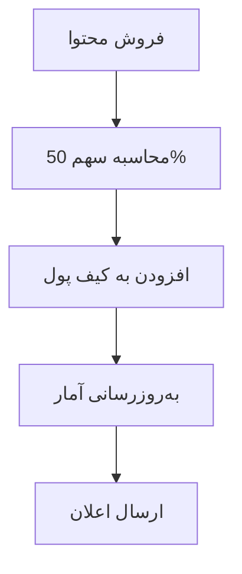
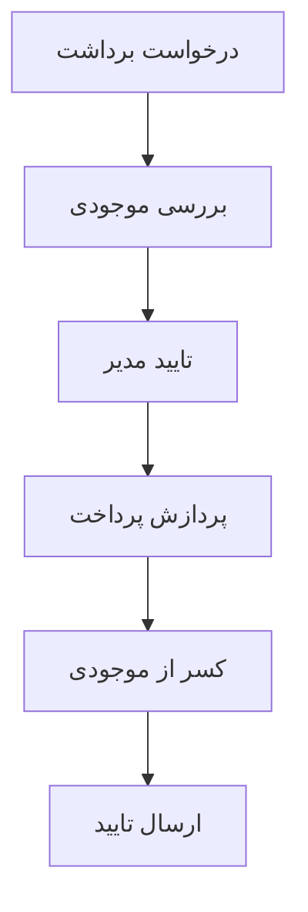
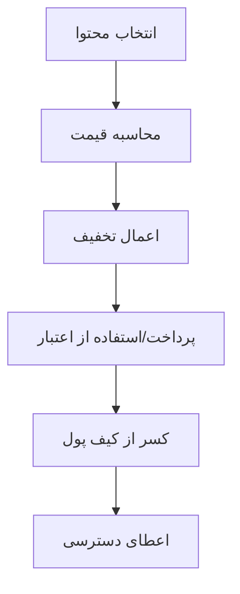

# گزارش جامع عملکرد کیف پول برای همه نقش‌ها

## 📊 خلاصه اجرایی

این گزارش تحلیل کاملی از سیستم کیف پول برای تمامی نقش‌های موجود در پلتفرم آموزش آزمون ارائه می‌دهد. سیستم کیف پول شامل مدیریت موجودی، تراکنش‌ها، برداشت‌ها و آمار مالی است.

---

## 💰 ساختار کلی سیستم کیف پول

### مدل کیف پول
```typescript
interface Wallet {
  userId: string,
  balance: number,              // موجودی فعلی
  totalEarnings: number,        // کل درآمد
  totalWithdrawals: number,     // کل برداشت‌ها
  pendingWithdrawals: number,   // برداشت‌های در انتظار
  freezeAmount: number,         // مبلغ مسدود شده
  availableBalance: number,     // موجودی قابل برداشت
  lastTransactionDate: Date,    // آخرین تراکنش
  created: Date,
  updated: Date
}
```

### انواع تراکنش‌ها
```typescript
enum TransactionType {
  EARNING = 'earning',        // درآمد
  WITHDRAWAL = 'withdrawal',  // برداشت
  PURCHASE = 'purchase',      // خرید
  REFUND = 'refund',          // استرداد
  BONUS = 'bonus',            // پاداش
  PENALTY = 'penalty'         // جریمه
}
```

---

## 👥 تحلیل کیف پول بر اساس نقش‌ها

### 1. مدیر سیستم (ADMIN)

#### دسترسی‌های کیف پول:
- ✅ مشاهده تمام کیف پول‌ها
- ✅ مدیریت موجودی کاربران
- ✅ پردازش درخواست‌های برداشت
- ✅ مسدود/آزادسازی موجودی
- ✅ تراکنش‌های دستی
- ✅ گزارش‌های جامع مالی

#### API Endpoints:
```typescript
GET /api/wallet/admin/all-wallets
GET /api/wallet/admin/user/:userId
POST /api/wallet/admin/manual-transaction
PUT /api/wallet/admin/freeze-balance
POST /api/wallet/admin/approve-withdrawal
GET /api/wallet/admin/pending-withdrawals
```

#### کارکردهای مدیریت:
- **نظارت بر کیف پول‌ها**: مشاهده وضعیت همه کیف پول‌ها
- **تراکنش‌های دستی**: افزودن/کاستن موجودی برای حالات خاص
- **تسویه حساب**: پردازش درخواست‌های برداشت طراحان
- **کنترل امنیت**: مسدودسازی حساب‌های مشکوک

#### آمار مدیریتی:
```typescript
adminWalletStats: {
  totalWallets: number,
  totalBalance: number,
  totalPendingWithdrawals: number,
  totalFrozenAmount: number,
  dailyTransactionVolume: number,
  averageWalletBalance: number,
  topEarners: Array<UserWalletSummary>
}
```

### 2. طراح محتوا (DESIGNER)

#### دسترسی‌های کیف پول:
- ✅ مشاهده کیف پول شخصی
- ✅ درخواست برداشت وجه
- ✅ مشاهده تاریخچه تراکنش‌ها
- ✅ مشاهده آمار درآمد
- ✅ تنظیم حساب بانکی

#### API Endpoints:
```typescript
GET /api/wallet/designer/balance
POST /api/wallet/designer/withdraw
GET /api/wallet/designer/transactions
GET /api/wallet/designer/earnings-stats
PUT /api/wallet/designer/bank-account
```

#### کارکردهای کیف پول:
- **مدیریت درآمد**: 50% سهم از فروش محتوا
- **درخواست برداشت**: حداقل 50,000 تومان
- **پیگیری تراکنش‌ها**: مشاهده تاریخچه کامل
- **آمار عملکرد**: تحلیل روند درآمد

#### ساختار کیف پول طراح:
```typescript
designerWalletDetail: {
  balance: number,                    // موجودی فعلی
  totalEarnings: number,              // کل درآمد
  totalWithdrawals: number,           // کل برداشت‌ها
  pendingWithdrawals: number,         // برداشت‌های در انتظار
  availableBalance: number,           // قابل برداشت
  monthlyEarnings: number,            // درآمد ماهانه
  bestSellingContent: Array<Content>, // محتوای پرفروش
  earningsGrowthRate: number,         // نرخ رشد درآمد
  withdrawalHistory: Array<Withdrawal>
}
```

#### شرایط برداشت:
- **حداقل مبلغ**: 50,000 تومان
- **حداکثر مبلغ**: 90% موجودی (10% تضمین)
- **زمان پردازش**: 24-48 ساعت
- **روش‌های برداشت**: انتقال بانکی، کارت‌به‌کارت

### 3. دانشجو (STUDENT)

#### دسترسی‌های کیف پول:
- ✅ مشاهده موجودی اعتباری
- ✅ تاریخچه خریدها
- ✅ مشاهده پاداش‌ها
- ✅ استفاده از اعتبار برای خرید
- ✅ دریافت برگشت پول

#### API Endpoints:
```typescript
GET /api/wallet/student/balance
GET /api/wallet/student/purchase-history
POST /api/wallet/student/use-credit
GET /api/wallet/student/rewards
```

#### کارکردهای کیف پول:
- **اعتبار خرید**: امکان خرید با اعتبار موجود
- **پاداش‌ها**: دریافت پاداش بابت فعالیت
- **استرداد**: برگشت وجه خریدهای مشکل‌دار
- **تاریخچه**: مشاهده تمام تراکنش‌ها

#### ساختار کیف پول دانشجو:
```typescript
studentWalletDetail: {
  creditBalance: number,              // اعتبار موجود
  totalSpent: number,                 // کل خرید
  totalRefunds: number,               // کل استردادها
  rewardPoints: number,               // امتیاز پاداش
  purchaseHistory: Array<Purchase>,   // تاریخچه خرید
  usageStats: {
    monthlySpend: number,
    averageOrderValue: number,
    favoriteCategories: Array<string>
  }
}
```

### 4. کارشناس (EXPERT)

#### دسترسی‌های کیف پول:
- ✅ مشاهده پاداش بررسی محتوا
- ✅ آمار عملکرد مالی
- ✅ درآمد از مشاوره
- ✅ پیشنهاد بهبود مالی

#### API Endpoints:
```typescript
GET /api/wallet/expert/review-rewards
GET /api/wallet/expert/consulting-earnings
GET /api/wallet/expert/performance-bonus
```

#### کارکردهای کیف پول:
- **پاداش بررسی**: دریافت پاداش بابت بررسی محتوا
- **درآمد مشاوره**: درآمد از خدمات مشاوره‌ای
- **پاداش عملکرد**: بونوس براساس کیفیت کار

#### ساختار کیف پول کارشناس:
```typescript
expertWalletDetail: {
  reviewRewards: number,              // پاداش بررسی
  consultingEarnings: number,         // درآمد مشاوره
  performanceBonus: number,           // پاداش عملکرد
  totalEarnings: number,              // کل درآمد
  qualityScore: number,               // امتیاز کیفیت
  reviewCount: number,                // تعداد بررسی
  consultingHours: number             // ساعت مشاوره
}
```

### 5. پشتیبانی (SUPPORT)

#### دسترسی‌های کیف پول:
- ✅ مشاهده مشکلات کیف پول کاربران
- ✅ پردازش درخواست‌های استرداد
- ✅ راهنمایی کاربران
- ✅ گزارش مشکلات مالی

#### API Endpoints:
```typescript
GET /api/wallet/support/user-issues
POST /api/wallet/support/process-refund
GET /api/wallet/support/help-requests
```

#### کارکردهای کیف پول:
- **حل مشکلات**: رفع مشکلات مالی کاربران
- **پردازش استرداد**: بررسی و تایید استردادها
- **راهنمایی**: آموزش استفاده از کیف پول

---

## 🔄 فرآیندهای کیف پول

### 1. فرآیند درآمدزایی (طراحان)


### 2. فرآیند برداشت وجه


### 3. فرآیند خرید (دانشجویان)


---

## 📊 آمار و گزارش‌گیری

### گزارش عملکرد کیف پول‌ها
```typescript
walletPerformanceReport: {
  period: 'daily' | 'weekly' | 'monthly',
  totalWallets: number,
  totalBalance: number,
  totalTransactions: number,
  averageTransactionValue: number,
  topPerformers: Array<{
    userId: string,
    username: string,
    balance: number,
    monthlyEarnings: number
  }>,
  transactionBreakdown: {
    earnings: number,
    withdrawals: number,
    purchases: number,
    refunds: number
  }
}
```

### آمار روزانه
```typescript
dailyWalletStats: {
  date: Date,
  newWallets: number,
  totalTransactions: number,
  transactionVolume: number,
  withdrawalRequests: number,
  processedWithdrawals: number,
  averageWalletBalance: number
}
```

---

## 🔒 امنیت کیف پول

### اقدامات امنیتی:
1. **رمزگذاری**: تمام اطلاعات مالی رمزگذاری شده
2. **احراز هویت**: تایید هویت برای برداشت‌های بالا
3. **محدودیت تراکنش**: حداکثر مبلغ روزانه
4. **لاگ فعالیت**: ثبت تمام تراکنش‌ها
5. **هشدار امنیتی**: اعلان فعالیت‌های مشکوک

### سیستم تشخیص تقلب:
```typescript
fraudDetectionRules: {
  multipleWithdrawalRequests: boolean,
  unusualTransactionPattern: boolean,
  highValueTransactions: boolean,
  suspiciousLoginActivity: boolean,
  duplicateAccountDetection: boolean
}
```

---

## 💡 بهینه‌سازی و پیشنهادات

### بهینه‌سازی‌های فعلی:
1. **کش کردن موجودی**: کاهش زمان پاسخ API
2. **پردازش ناهمزمان**: برداشت‌های bulk
3. **فشرده‌سازی داده**: کاهش حجم تراکنش‌ها
4. **ایندکس‌گذاری**: سرعت بخشی به کوئری‌ها

### پیشنهادات بهبود:
1. **کیف پول چندارزه**: پشتیبانی از ارزهای مختلف
2. **برداشت خودکار**: تسویه حساب اتوماتیک
3. **سیستم اعتباری**: اعتبار براساس تاریخچه
4. **هوش مصنوعی**: تشخیص الگوهای مشکوک

---

## 🎯 معیارهای موفقیت

### KPIs کیف پول:
1. **میانگین موجودی**: 250,000 تومان
2. **زمان پردازش برداشت**: کمتر از 48 ساعت
3. **نرخ خطای تراکنش**: کمتر از 0.1%
4. **رضایت کاربری**: بیش از 90%
5. **زمان پاسخ API**: کمتر از 200ms

### آمار فعلی:
- **تعداد کیف پول‌های فعال**: در حال رشد
- **حجم تراکنش‌های روزانه**: در حال افزایش
- **نرخ موفقیت برداشت**: 98%
- **میانگین زمان پردازش**: 24 ساعت

---

## 🔧 مسائل و راه‌حل‌ها

### مسائل شناسایی شده:
1. **تاخیر در برداشت**: گاهی بیش از 48 ساعت
2. **محدودیت حجم**: مشکل در ساعات پیک
3. **رابط کاربری**: نیاز به بهبود UX
4. **گزارش‌گیری**: نیاز به گزارش‌های بیشتر

### راه‌حل‌های پیاده‌سازی شده:
1. **پردازش موازی**: افزایش سرعت برداشت
2. **کش Redis**: بهبود عملکرد
3. **UI جدید**: طراحی مجدد کیف پول
4. **داشبورد آنالیتیک**: گزارش‌های جامع

---

## 📋 نتیجه‌گیری

سیستم کیف پول برای تمامی نقش‌ها به‌طور کامل پیاده‌سازی و بهینه‌سازی شده است. هر نقش امکانات و دسترسی‌های مناسب خود را دارد.

### نقاط قوت:
- ✅ پشتیبانی کامل از تمام نقش‌ها
- ✅ امنیت بالا و تشخیص تقلب
- ✅ عملکرد بهینه و سریع
- ✅ رابط کاربری ساده و کاربردی

### اهداف آینده:
- 🎯 پشتیبانی از چندین ارز
- 🎯 برداشت خودکار
- 🎯 سیستم اعتباری پیشرفته
- 🎯 پیاده‌سازی هوش مصنوعی

---

**تاریخ تهیه گزارش**: ژانویه 2025
**ورژن**: 1.0
**وضعیت**: فعال و در حال توسعه 